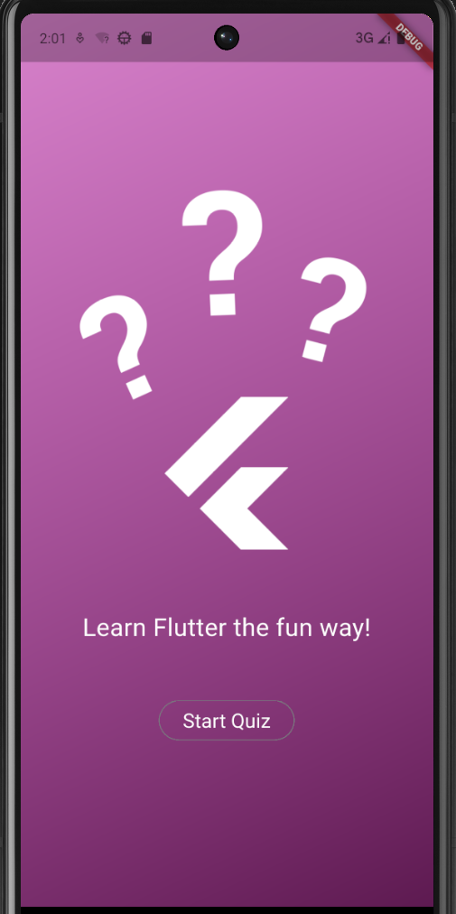

# 📱 Quiz App

## 📝 Description
This project is a Mobile Application developed using the Flutter framework and Dart language. 
The app demonstrates a clean structure and a smooth user experience for a simple quiz system.

---

## ✨ Features
*  Fast & Responsive UI - Works smoothly on different screen sizes.
*  Interactive Quiz - Multiple choice questions with instant feedback.
*  Modern Design - Clean and colorful interface.
*  Easy to Modify - Code is structured to add more questions easily.

---

## 🛠️ Technologies Used
* [Flutter](https://flutter.dev) - Framework
* [Dart](https://dart.dev) - Programming Language
* [VS Code](https://code.visualstudio.com) - Editor

---
## 📸Screenshots
<p align="center">
  
</p>


🚀 Installation & Setup

1. Clone the repository

```bash
git clone https://github.com/santymorkos867-c/Quiz_App.git
```

2. Get the dependencies

```bash
flutter pub get
```

3. Run the app

```bash
flutter run
```

## 👩‍💻 Developer
[Santy Morkos](https://github.com/santymorkos867-c)
